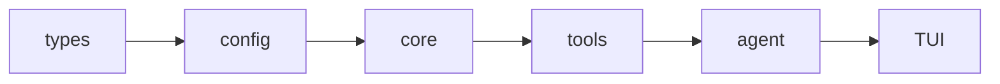

<div align="center">

<picture>
  
</picture>

**Secure, open, universal terminal coding agent in Rust.**

[](https://agentskills.io/)
[](./docs/guides/zed-acp.md)
[](./docs/guides/mcp-integration.md)
[](./docs/guides/agent-plugins.md)
[](https://deepwiki.com/vinhnx/VTCode)

</div>

> [!TIP]
> New here? Start with [Installation](./docs/installation/README.md), then
> [Getting Started](./docs/user-guide/getting-started.md).

<details>
<summary><strong>Contents</strong></summary>

- [Overview](#overview)
- [Why VT Code](#why-vt-code)
- [Quick start](#quick-start)
  - [1. Install](#1-install)
  - [2. Configure](#2-configure)
  - [3. Run](#3-run)
  - [WebMCP browser bridge (opt-in)](#webmcp-browser-bridge-opt-in)
- [Documentation](#documentation)
- [Providers](#providers)
- [Development](#development)
- [Contributing](#contributing)
  - [Ways to contribute](#ways-to-contribute)
  - [Getting started](#getting-started)
  - [Contributors](#contributors)
- [Support](#support)
  - [Sponsorship](#sponsorship)
- [License](#license)

</details>

## Overview

<div align="center">


<br />
<em>Secure, open, universal.</em>

</div>

VT Code is an open-source Rust terminal coding agent for interactive and
long-running autonomous work. It is a **harness, not just an LLM wrapper**:
the model provides reasoning, while the runtime provides the tools, context,
sandbox, state, evaluation, and verification needed to turn that reasoning into
safe, reviewable progress.

A responsive TUI, multi-provider LLM support, durable sessions, open protocols,
and extensible Skills take you from question to reviewed change without leaving
the terminal.

> [!NOTE]
> **Status:** Active development. Local inference and some automation flows are
> experimental and may change between releases.

> [!TIP]
> **Behind the build:** [Building VT Code, a year in](https://huggingface.co/blog/vinhnx90/building-vtcode-a-year-in):
> harness design, evals, security, and lessons from a year of building.
>
> **Video companions:** [Podcast](https://www.youtube.com/watch?v=XLoswcd5rH0) ·
> [Video](https://www.youtube.com/watch?v=PvL_kPjgU6o).

| Podcast companion                                                                                                                                                            | Video companion                                                                                                                                                            |
| ---------------------------------------------------------------------------------------------------------------------------------------------------------------------------- | -------------------------------------------------------------------------------------------------------------------------------------------------------------------------- |
| <a href="https://www.youtube.com/watch?v=XLoswcd5rH0"></a> | <a href="https://www.youtube.com/watch?v=PvL_kPjgU6o"></a> |
| [Watch the podcast](https://www.youtube.com/watch?v=XLoswcd5rH0)                                                                                                             | [Watch the video](https://www.youtube.com/watch?v=PvL_kPjgU6o)                                                                                                             |

## Why VT Code

| Pillar                     | What it means                                                                                                                                 |
| -------------------------- | --------------------------------------------------------------------------------------------------------------------------------------------- |
| **Harness, not a wrapper** | The model reasons; the harness composes tools, context, sandbox, state, and evaluations to enforce progress.                                  |
| **Safety-first execution** | Sandboxed shell, command policies, workspace approvals, and fail-closed defenses for injection, path/symlink escape, and environment leakage. |
| **Long-run reliability**   | Durable session memory, task tracking, spooled output, checkpoints, automatic compaction, resumable handoffs, and verification before "done". |
| **Observable by design**   | A canonical `ThreadEvent` runtime contract supports replay, archives, checkpoints, memory views, and trajectory export.                       |
| **Protocol-native**        | MCP, Skills, Agent Plugins, ACP (Zed), A2A, WebMCP, Open Responses, and ATIF extend the system without core forks.                            |
| **Controlled autonomy**    | Planning, human approval, isolated worktrees, propose/verify sub-agents, full automation, and cost guardrails scale autonomy safely.          |
| **Runs anywhere**          | 30 providers plus local Ollama, LM Studio, and llama.cpp.                                                                                     |

## Quick start

### 1. Install

```bash
curl -fsSL https://raw.githubusercontent.com/vinhnx/vtcode/main/scripts/install.sh | bash
# or: brew install vinhnx/tap/vtcode | cargo install vtcode
```

### 2. Configure

```bash
cd path/to/your/project
vtcode init                    # scaffolds config + AGENTS.md; review before committing
export OPENAI_API_KEY="sk-..." # or `vtcode login` for OAuth providers
```

### 3. Run

```bash
vtcode                         # interactive TUI
vtcode ask "explain Rc vs Arc" # one-shot question
vtcode exec "refactor main.rs" # headless task
vtcode review                  # review uncommitted changes
```

See [Installation](./docs/installation/README.md) and
[Getting Started](./docs/user-guide/getting-started.md).

> [!CAUTION]
> Never commit API keys or put them in `vtcode.toml`.

### WebMCP browser bridge (opt-in)

> [!NOTE]
> Pair a running session from the TUI or serve a bounded workspace for
> authenticated browser editing.

```bash
# Inside the TUI:
/webmcp pair <origin>

# Or serve a bounded workspace:
vtcode webmcp serve --origin <origin> --allowed-root <dir>
```

| Host       | Link                                                      |
| ---------- | --------------------------------------------------------- |
| Hosted app | <https://vtcode.vinhnx.chatgpt.site/>                     |
| Fallback   | <https://vinhnx.github.io/VTCode/>                        |
| User guide | [WebMCP user guide](./docs/user-guide/webmcp.md)          |
| Deployment | [WebMCP deployment reference](./docs/reference/webmcp.md) |

## Documentation

| Area    | Guides                                                                                                                                                                                                                                                                                                                                                                                            |
| ------- | ------------------------------------------------------------------------------------------------------------------------------------------------------------------------------------------------------------------------------------------------------------------------------------------------------------------------------------------------------------------------------------------------- |
| Start   | [Installation](./docs/installation/README.md) · [Getting started](./docs/user-guide/getting-started.md) · [Wiki](https://github.com/vinhnx/VTCode/wiki) · [Blog: Building VT Code, a year in](https://huggingface.co/blog/vinhnx90/building-vtcode-a-year-in) · [Podcast companion](https://www.youtube.com/watch?v=XLoswcd5rH0) · [Video companion](https://www.youtube.com/watch?v=PvL_kPjgU6o) |
| Use     | [TUI](./docs/user-guide/interactive-mode.md) · [CLI](./docs/user-guide/commands.md) · [WebMCP](./docs/user-guide/webmcp.md) · [Automation](./docs/guides/full-automation.md) · [Planning](./docs/guides/planning-workflow.md) · [Configuration](./docs/config/CONFIG_FIELD_REFERENCE.md)                                                                                                          |
| Extend  | [Skills](./docs/skills/SKILLS_GUIDE.md) · [Plugins](./docs/guides/agent-plugins.md) · [MCP](./docs/guides/mcp-integration.md) · [Editors](./docs/guides/zed-acp.md)                                                                                                                                                                                                                               |
| Operate | [Safety](./docs/security/SECURITY_MODEL.md) · [Protocols](./docs/protocols/OPEN_RESPONSES.md) · [Loop engineering](./docs/project/PLAN-loop-engineering.md) · [Architecture](./docs/ARCHITECTURE.md)                                                                                                                                                                                              |

## Providers

30 built-in providers, custom OpenAI-compatible endpoints, and local backends.
[Provider Guides](./docs/providers/PROVIDER_GUIDES.md) is the source of truth
for credentials and model defaults.

Custom providers support opt-in pricing in USD per million tokens. ACP emits
`costUSD` only when both input and output rates are configured; see
[custom-provider pricing](./docs/config/config.md).

```bash
vtcode models list
vtcode models config
```

> [!TIP]
> Restrict providers per workspace with `providers_whitelist` in `vtcode.toml`.
> Local inference (experimental) via Ollama, LM Studio, and llama.cpp is managed
> with `/local` in the TUI - see [Local Models](./docs/guides/local-models.md).

## Development



1. Clone and run the fast gate:

```bash
git clone https://github.com/vinhnx/vtcode.git
cd vtcode
./scripts/run-debug.sh
./scripts/check-dev.sh   # fast gate: clippy, fmt, check
cargo nextest run        # tests (never `cargo test`)
```

Rust stable, edition 2024. ~30 crates layered as
`types → config → core → tools → agent → TUI`, with `ThreadEvent` as the
authoritative runtime contract.

See [Development setup](./docs/development/DEVELOPMENT_SETUP.md) and
[Testing](./docs/development/testing.md).

## Contributing

VT Code grows with its community. Bug fixes, docs, ideas, testing, and
reviews are all welcome.

### Ways to contribute

- **Security advisories**: Please report vulnerabilities privately first: [Security Policy](https://github.com/vinhnx/VTCode/security/policy).
- **Bug fixes and patches**: Small or large, every fix counts.
- **Documentation**: Guides, examples, and corrections help everyone.
- **Features and ideas**: Open an issue or start a discussion.
- **Code reviews and testing**: Trying things out and reporting breakage keeps the project healthy.

### Getting started

- Browse [good first issues](https://github.com/vinhnx/vtcode/issues?q=is%3Aopen+is%3Aissue+label%3A%22good+first+issue%22)
- Read [CONTRIBUTING.md](./docs/CONTRIBUTING.md) for humans
- Check [AGENTS.md](./AGENTS.md) for AI agents

> [!NOTE]
> Small, focused PRs merge fastest. If you get stuck, open an issue for help.

### Contributors

Thank you to everyone who shaped VT Code.

<details>
<summary><strong>Show all contributors</strong></summary>

<div align="center">
  <a href="https://github.com/kernitus"></a>&nbsp;
  <a href="https://github.com/7jrxt42BxFZo4iAnN4CX"></a>&nbsp;
  <a href="https://github.com/oiwn"></a>&nbsp;
  <a href="https://github.com/Sachin-Bhat"></a>&nbsp;
  <a href="https://github.com/chenrui333"></a>&nbsp;
  <a href="https://github.com/gzsombor"></a>&nbsp;
  <a href="https://github.com/leonj1"></a>&nbsp;
  <a href="https://github.com/netbrah"></a>&nbsp;
  <a href="https://github.com/xcrong"></a>&nbsp;
  <a href="https://github.com/lucaszhu-hue"></a>&nbsp;
  <a href="https://github.com/raphamorim"></a>&nbsp;
  <a href="https://github.com/nnfrog"></a>&nbsp;
  <a href="https://github.com/glmgbj233"></a>&nbsp;
  <a href="https://github.com/EvoLinkAI"></a>&nbsp;
  <a href="https://github.com/diegosouzapw"></a>&nbsp;
  <a href="https://github.com/ForrestThump"></a>&nbsp;
  <a href="https://github.com/morler"></a>&nbsp;
  <a href="https://github.com/poelzi"></a>&nbsp;
  <a href="https://github.com/RobertBorg"></a>&nbsp;
  <a href="https://github.com/Sanjays2402"></a>&nbsp;
  <a href="https://github.com/TuanLe-bk18"></a>&nbsp;
  <a href="https://github.com/uiYzzi"></a>
</div>

</details>

## Support

### Sponsorship

VT Code is built and maintained in spare time. If it helped you ship or learn
something, a [sponsorship](https://github.com/sponsors/vinhnx) keeps the
project independent.

<div align="center">
  <a href="https://github.com/dnhn"></a>
  <a href="https://github.com/codemod"></a>
  <a href="https://github.com/coderabbitai"></a>
  <a href="https://github.com/KhaiRyth"></a>
</div>

<div align="center">

[](https://github.com/sponsors/vinhnx)
<a href="https://buymeacoffee.com/vinhnx"></a>

</div>

## License

First-party code is **MIT OR Apache-2.0**. See [LICENSE](LICENSE).
Third-party code keeps its original licenses: see [THIRD-PARTY-NOTICES](THIRD-PARTY-NOTICES).

<div align="right">

[Back to top](#contents)

</div>
